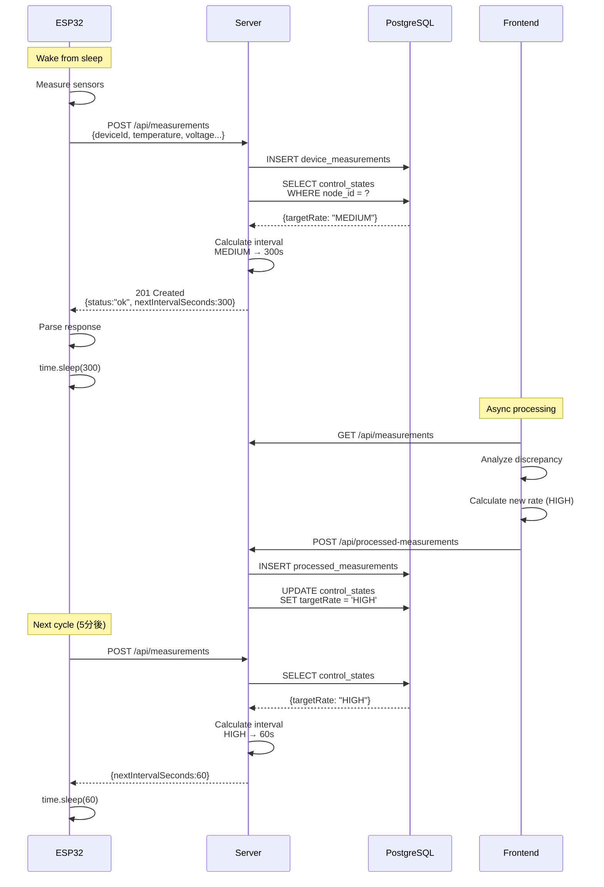

# ESP32 Adaptive Interval Control Architecture

## 📋 概要

ESP32からのデータ送信間隔を、サーバー側で計算されたレート制御の結果に基づいて動的に調整するシステム。

**目的**:
- バッテリー寿命の最適化
- ネットワーク負荷の削減
- 異常検知時の高頻度監視と通常時の省電力運用の両立

---

## 🏗️ システムアーキテクチャ

### データフロー

```
┌─────────────┐
│   ESP32     │
│  (センサー)   │
└──────┬──────┘
       │ 1. 温度・電圧データを測定
       │ 2. POST /api/measurements
       ▼
┌─────────────────────┐
│  Render Backend     │
│  (Express + PG)     │
├─────────────────────┤
│ 1. データをDB保存    │
│ 2. control_states    │
│    テーブルを参照    │
│ 3. targetRateから    │
│    間隔を計算        │
│ 4. nextIntervalを    │
│    レスポンスに含む  │
└──────┬──────────────┘
       │ Response:
       │ { status: "ok",
       │   nextIntervalSeconds: 300 }
       ▼
┌─────────────┐
│   ESP32     │
├─────────────┤
│ 1. レスポンス │
│    をパース   │
│ 2. 次回sleep  │
│    時間を設定 │
│ 3. deep sleep │
└─────────────┘
       │
       │ (300秒後)
       │
       ▼
    [ループ継続]


┌──────────────────┐
│  Frontend        │
│  (Browser JS)    │
├──────────────────┤
│ 1. 天気予報取得  │
│ 2. 誤差解析      │
│ 3. レート判定    │
│    (LOW/MED/HIGH)│
│ 4. control_states│
│    を更新        │
└──────────────────┘
```

### シーケンス図



---

## ⚙️ レート→間隔マッピング

### 設定値（server.js）

```javascript
const RATE_INTERVAL_MAP = {
  HIGH: 60,       // 1分  - 異常検知時の高頻度監視
  MEDIUM: 300,    // 5分  - 通常運用
  LOW: 900,       // 15分 - 省電力モード
  DEFAULT: 300    // 5分  - 初回起動時・不明時
};
```

### レート判定基準（analytics-engine.js）

| Error Score (sErr) | Target Rate | 送信間隔 | 用途 |
|-------------------|-------------|---------|------|
| < 0.45 | **HIGH** | 60秒 (1分) | 予測誤差が大きい→異常の可能性 |
| 0.45 ~ 0.70 | **MEDIUM** | 300秒 (5分) | 通常範囲内の誤差 |
| ≥ 0.70 | **LOW** | 900秒 (15分) | 予測精度が高い→安定状態 |

**Error Score計算式**:
```
sErr = exp(-mEwma / sigmaDay)

mEwma: 誤差のEWMA（指数加重移動平均）
sigmaDay: 過去48サンプルの標準偏差
```

---

## 🔋 バッテリー寿命への影響

### 前提条件

- **バッテリー容量**: 2000mAh（単3電池×2本）
- **Active時消費電流**: 80mA（WiFi送信中）
- **Deep Sleep時消費電流**: 10μA
- **Active継続時間**: 5秒/回（測定+送信）

### 寿命試算

#### HIGH モード（1分間隔）
```
Active比率: 5秒/60秒 = 8.3%
平均消費電流 = 80mA × 0.083 + 0.01mA × 0.917
            = 6.64mA + 0.009mA
            = 6.65mA

バッテリー寿命 = 2000mAh / 6.65mA
              = 300.8時間
              ≈ 12.5日
```

#### MEDIUM モード（5分間隔）
```
Active比率: 5秒/300秒 = 1.67%
平均消費電流 = 80mA × 0.0167 + 0.01mA × 0.983
            = 1.34mA + 0.01mA
            = 1.35mA

バッテリー寿命 = 2000mAh / 1.35mA
              = 1481時間
              ≈ 62日 (2ヶ月)
```

#### LOW モード（15分間隔）
```
Active比率: 5秒/900秒 = 0.56%
平均消費電流 = 80mA × 0.0056 + 0.01mA × 0.994
            = 0.45mA + 0.01mA
            = 0.46mA

バッテリー寿命 = 2000mAh / 0.46mA
              = 4348時間
              ≈ 181日 (6ヶ月)
```

### 比較表

| Mode | 間隔 | 平均消費 | バッテリー寿命 | 比率 |
|------|------|---------|---------------|------|
| HIGH | 1分 | 6.65mA | 12.5日 | 1.0x |
| MEDIUM | 5分 | 1.35mA | 62日 | 5.0x |
| LOW | 15分 | 0.46mA | 181日 | 14.5x |

**LOWモードはHIGHモードの14.5倍のバッテリー寿命**

---

## 📝 実装詳細

### 1. サーバー側実装

#### server.js の変更点

**calculateNextInterval関数の追加**:
```javascript
async function calculateNextInterval(deviceId) {
  const controlState = await getControlState(deviceId);

  if (!controlState || !controlState.targetRate) {
    return RATE_INTERVAL_MAP.DEFAULT; // 300秒
  }

  const targetRate = controlState.targetRate;
  const interval = RATE_INTERVAL_MAP[targetRate] || RATE_INTERVAL_MAP.DEFAULT;

  console.log(`📊 [interval-control] Device ${deviceId}: targetRate=${targetRate}, nextInterval=${interval}s`);

  return interval;
}
```

**POST /api/measurements レスポンス変更**:
```javascript
// 旧レスポンス
{ status: 'ok' }

// 新レスポンス
{
  status: 'ok',
  nextIntervalSeconds: 300,
  message: 'Measurement recorded successfully'
}
```

### 2. ESP32側実装

#### boot.py の変更点

**send_to_render()の戻り値変更**:
```python
# 旧実装
def send_to_render(...):
    # ...
    if status_code == 201:
        return True  # bool
    return False

# 新実装
def send_to_render(...):
    # ...
    if status_code == 201:
        response_data = ujson.loads(response.text)
        next_interval = response_data.get('nextIntervalSeconds', 300)
        log_message(f"  Server recommended interval: {next_interval}s ({next_interval//60}min)")
        return (True, next_interval)  # tuple
    return (False, 300)
```

**send_with_retry()の戻り値変更**:
```python
def send_with_retry(...):
    """
    Returns:
        tuple: (success: bool, next_interval: int)
    """
    for attempt in range(1, max_retries + 1):
        success, next_interval = send_to_render(...)
        if success:
            return (True, next_interval)
        # retry logic...
    return (False, 300)
```

**main loop の変更**:
```python
# デフォルト間隔
sleep_interval = 300

if wifi_connected and temp is not None and voltage is not None:
    send_success, next_interval = send_with_retry(DEVICE_ID, temp, humidity, voltage, current, power)

    if send_success:
        # サーバー推奨間隔を使用
        sleep_interval = next_interval

log_message(f"Loop completed, sleeping for {sleep_interval}s ({sleep_interval//60}min)")
time.sleep(sleep_interval)
```

---

## 🧪 テスト方法

### 1. ローカルテスト（開発環境）

```bash
# バックエンド起動
cd web-service
npm install
npm run dev

# 別ターミナルでテスト送信
curl -X POST http://localhost:3000/api/measurements \
  -H "Content-Type: application/json" \
  -d '{
    "deviceId": "esp32-test-01",
    "temperature": 25.5,
    "humidity": 60.0
  }'

# Expected response:
# {
#   "status": "ok",
#   "nextIntervalSeconds": 300,
#   "message": "Measurement recorded successfully"
# }
```

### 2. control_statesを手動で変更してテスト

```sql
-- PostgreSQLに接続
psql $DATABASE_URL

-- 現在の状態確認
SELECT node_id, target_rate, updated_at FROM control_states;

-- レートをHIGHに変更
UPDATE control_states
SET target_rate = 'HIGH',
    updated_at = NOW()
WHERE node_id = 'esp32-test-01';

-- 再度API呼び出し→nextIntervalSecondsが60になるはず
```

### 3. ESP32実機テスト

```python
# test_api_send.pyを実行
import test_api_send
test_api_send.run_full_test()

# 期待される出力:
# ✓ Response received in XXXms
#   Status Code: 201
#   Result: ✓ SUCCESS - Data accepted by server
#
#   Response body:
#   {"status":"ok","nextIntervalSeconds":300,"message":"Measurement recorded successfully"}
#
#   📊 Server recommended next interval:
#      300s (5min)
```

### 4. レート変化のシミュレーション

**シナリオ**: 温度異常を検出してHIGHモードに切り替わる

```bash
# Step 1: 正常データ送信（MEDIUM → 300s）
curl -X POST https://m2r.onrender.com/api/measurements \
  -H "Content-Type: application/json" \
  -d '{"deviceId": "esp32-node-01", "temperature": 25.0}'

# フロントエンドで予測温度24.5°C、観測25.0°Cと仮定
# 誤差が小さいのでMEDIUM維持

# Step 2: 異常データ送信（天気予報と大きくずれる）
# フロントエンドが処理して control_states を HIGH に更新

# Step 3: 次回送信時（HIGH → 60s）
curl -X POST https://m2r.onrender.com/api/measurements \
  -H "Content-Type: application/json" \
  -d '{"deviceId": "esp32-node-01", "temperature": 30.0}'

# Response: {"status":"ok","nextIntervalSeconds":60,...}
```

---

## 🚀 デプロイ手順

### 1. Renderへのデプロイ

```bash
# 変更をコミット
git add web-service/src/server.js esp32/boot.py esp32/test_api_send.py
git commit -m "feat: implement adaptive interval control for ESP32

- Add calculateNextInterval() function to server
- Return nextIntervalSeconds in POST /api/measurements response
- Update ESP32 to parse and use dynamic sleep intervals
- Support HIGH(60s), MEDIUM(300s), LOW(900s) modes
- Improve battery life by up to 14.5x in LOW mode"

# Renderに自動デプロイされる
git push origin main
```

### 2. ESP32へのアップロード

```bash
# boot.pyをESP32にアップロード
mpremote fs cp esp32/boot.py :boot.py

# test_api_send.pyもアップロード（テスト用）
mpremote fs cp esp32/test_api_send.py :test_api_send.py

# ESP32をリセット
mpremote reset
```

### 3. 動作確認

```bash
# ESP32のログを監視
mpremote repl

# ログに以下が表示されるはず:
# ✓ Data sent successfully to Render!
#   Server recommended interval: 300s (5min)
# Loop 1 completed, sleeping for 300s (5min)
```

---

## 📊 監視とログ

### サーバー側ログ

```
📊 [interval-control] Device esp32-node-01: targetRate=MEDIUM, nextInterval=300s
📊 [interval-control] Device esp32-node-01: targetRate=HIGH, nextInterval=60s
📊 [interval-control] No control state for device esp32-test-99, using DEFAULT interval: 300s
```

### ESP32側ログ

```
Sending data to https://m2r.onrender.com/api/measurements
  Temperature: 25.3°C
  Voltage: 4.15V, Current: 45.2mA, Power: 187.6mW
API response: HTTP 201
✓ Data sent successfully to Render!
  Server recommended interval: 300s (5min)
Loop 1 completed, sleeping for 300s (5min)
```

---

## 🔧 トラブルシューティング

### 問題1: 常に300秒（MEDIUM）のまま変わらない

**原因**: control_statesテーブルにデータがない

**解決策**:
```sql
-- デバイスの制御状態を初期化
INSERT INTO control_states (node_id, target_rate, updated_at)
VALUES ('esp32-node-01', 'MEDIUM', NOW())
ON CONFLICT (node_id) DO UPDATE SET updated_at = NOW();
```

### 問題2: ESP32がレスポンスをパースできない

**症状**:
```
Warning: Failed to parse interval, using default 300s
```

**原因**: サーバーレスポンスのJSON形式が不正

**デバッグ**:
```python
# test_api_send.pyでレスポンスを確認
import test_api_send
test_api_send.test_api_send()

# Response bodyを手動でチェック
```

### 問題3: バッテリーがすぐに切れる

**確認ポイント**:
1. 実際の送信間隔をログで確認
2. control_statesのtargetRateを確認（HIGHになっていないか）
3. WiFi接続失敗時のリトライが無限ループしていないか

**対策**:
```sql
-- 強制的にLOWモードに変更
UPDATE control_states
SET target_rate = 'LOW'
WHERE node_id = 'esp32-node-01';
```

---

## 🔮 将来の拡張案

### 1. 時間帯別の基準値設定

```javascript
// 夜間は間隔を長くして省電力
const getTimeBasedInterval = (targetRate) => {
  const hour = new Date().getHours();
  const isNightTime = hour >= 22 || hour < 6;

  let interval = RATE_INTERVAL_MAP[targetRate];
  if (isNightTime) {
    interval *= 2; // 夜間は2倍の間隔
  }
  return interval;
};
```

### 2. Deep Sleepの実装

現在は`time.sleep()`を使用しているが、deep sleepに変更することで更なる省電力化が可能:

```python
import machine

# Deep sleep（マイクロ秒単位）
machine.deepsleep(sleep_interval * 1000000)
```

**注意**: Deep sleep使用時はRTCメモリ以外の変数が消えるため、設計変更が必要

### 3. 複数デバイスのグループ制御

```javascript
// デバイスグループごとに異なる間隔設定
const DEVICE_GROUPS = {
  critical: { HIGH: 30, MEDIUM: 120, LOW: 600 },   // 重要センサー
  normal: { HIGH: 60, MEDIUM: 300, LOW: 900 },     // 通常センサー
  lowPriority: { HIGH: 300, MEDIUM: 900, LOW: 3600 } // 低優先度
};
```

### 4. 間隔変更履歴の記録

```sql
CREATE TABLE interval_history (
  id SERIAL PRIMARY KEY,
  device_id TEXT NOT NULL,
  old_interval INT,
  new_interval INT,
  reason TEXT,
  changed_at TIMESTAMPTZ DEFAULT NOW()
);
```

---

## 📚 関連ファイル

| ファイル | 役割 |
|---------|-----|
| `web-service/src/server.js` | バックエンドAPI（間隔計算ロジック） |
| `shared/persistence.js` | control_states テーブル操作 |
| `esp32/boot.py` | ESP32メインプログラム（動的間隔対応） |
| `esp32/test_api_send.py` | API接続テストスクリプト |
| `public/js/analytics-engine.js` | レート判定ロジック（フロントエンド） |
| `ESP32_INTERVAL_CONTROL.md` | 本ドキュメント |

---

## ✅ チェックリスト

デプロイ前の確認事項:

- [ ] server.jsに`calculateNextInterval()`関数が追加されている
- [ ] `RATE_INTERVAL_MAP`の設定値が妥当
- [ ] POST /api/measurements のレスポンスに`nextIntervalSeconds`が含まれる
- [ ] ESP32の`send_to_render()`がtupleを返す
- [ ] ESP32の`send_with_retry()`がtupleを返す
- [ ] main loopで`sleep_interval`を動的に設定している
- [ ] test_api_send.pyでレスポンスを確認できる
- [ ] control_statesテーブルにデータが存在する
- [ ] Renderにデプロイ済み
- [ ] ESP32にboot.pyをアップロード済み
- [ ] 実機で動作確認済み

---

**作成日**: 2025-10-09
**バージョン**: 1.0.0
**作成者**: Claude Code AI
