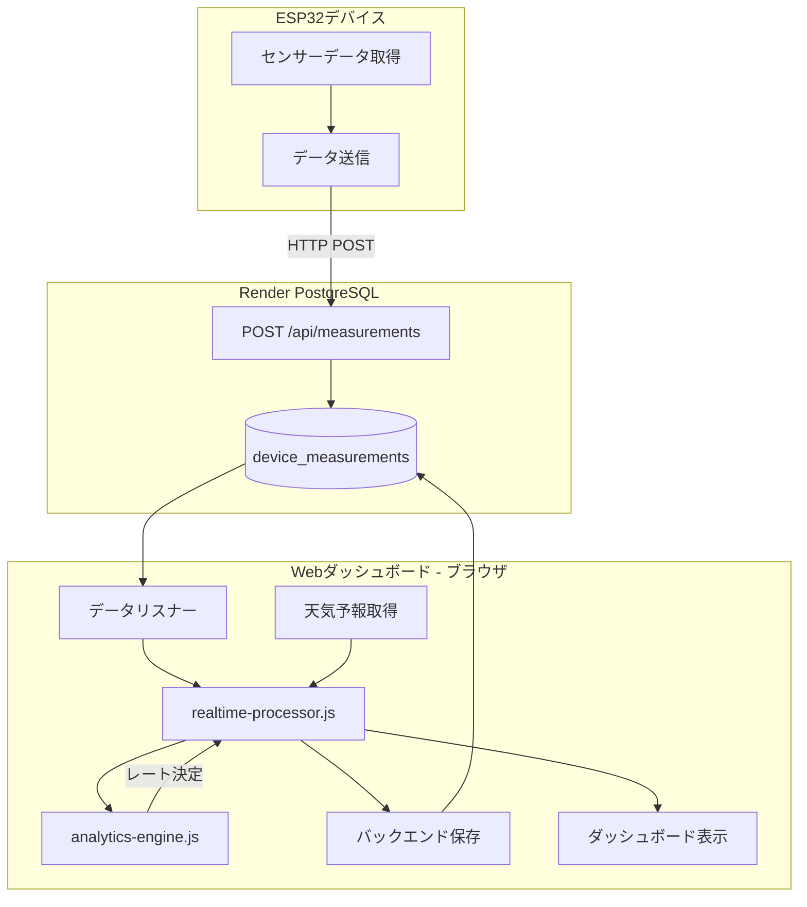

# 🎛️ レート制御アーキテクチャ解析

## 📊 システム全体のレート制御フロー



---

## 🔍 レート制御の実装場所

### ❌ **ESP32側: レート制御なし**

**場所**: [esp32/boot.py](esp32/boot.py)

**役割**:
- センサーデータ取得のみ
- 温度・湿度・電圧・電流データを測定
- Render APIへHTTP POST送信
- **レート制御は行わない**

**実装状況**:
```python
# ESP32はセンサーデータを取得して送信するのみ
# レート制御ロジックは含まれていない

while True:
    # センサー読み取り
    temp = bmp_sensor.temperature
    voltage = ina.voltage()

    # Render APIへ送信
    send_to_render(DEVICE_ID, temp, voltage, ...)

    time.sleep(300)  # 5分待機
```

---

### ❌ **Renderバックエンド: レート制御なし**

**場所**: [web-service/src/server.js](web-service/src/server.js)

**役割**:
- データの受信・保存
- データのクエリ・取得
- **レート制御は行わない**

**実装状況**:
```javascript
// Renderはデータの保存のみ
app.post('/api/measurements', async (req, res) => {
  const { deviceId, temperature, humidity, ... } = req.body;

  // PostgreSQLに保存
  await insertDeviceMeasurement({
    deviceId,
    temperature,
    humidity,
    recordedAt,
    payload
  });

  return res.status(201).json({ status: 'ok' });
});
```

---

### ✅ **フロントエンド（ブラウザ）: レート制御の中核**

## 1️⃣ analytics-engine.js - レート決定ロジック

**場所**: [public/js/analytics-engine.js](public/js/analytics-engine.js:96-164)

### **RateController クラス**

#### **主要メソッド: `decideRate()`**

```javascript
/**
 * レート決定アルゴリズム
 * @param {number} sErr - システム誤差スコア (0-1)
 * @param {string} previousRate - 前回のレート (LOW/MEDIUM/HIGH)
 * @param {string} safetyFloor - 最低レート保証 (デフォルト: LOW)
 * @returns {Object} { targetRate, previousRate, reason }
 */
static decideRate(sErr, previousRate, safetyFloor = 'LOW') {
  const { thresholds } = appConfig.control;

  // ステップ1: スコアに基づく基本判定
  let candidate;
  if (sErr < 0.45) {          // escalateHigh
    candidate = 'HIGH';
  } else if (sErr < 0.7) {    // escalateMedium
    candidate = 'MEDIUM';
  } else {
    candidate = 'LOW';
  }

  // ステップ2: ヒステリシス処理（振動防止）
  if (previousRate === 'HIGH' && sErr > 0.55) {  // demoteFromHigh
    candidate = 'MEDIUM';
  }
  if (previousRate === 'MEDIUM' && sErr >= 0.8) { // demoteFromMedium
    candidate = 'LOW';
  }

  // ステップ3: セーフティフロア適用
  const targetRate = clampToSafetyFloor(candidate, safetyFloor);

  // ステップ4: 理由を決定
  let reason = "baseline-threshold";
  if (targetRate !== candidate) {
    reason = "safety-floor";
  } else if (targetRate !== previousRate) {
    reason = targetRate === 'HIGH' ? "escalate" : "de-escalate";
  } else {
    reason = "hold";
  }

  return { targetRate, previousRate, reason };
}
```

---

### **設定値（app-config.js）**

```javascript
appConfig.control = {
  alpha: 0.3,              // EWMA平滑化係数
  sampleLimit: 48,         // サンプル保持数（2日分）
  safetyFloor: 'LOW',      // 最低レート保証
  thresholds: {
    escalateHigh: 0.45,    // HIGH昇格閾値
    escalateMedium: 0.7,   // MEDIUM昇格閾値
    demoteFromHigh: 0.55,  // HIGH降格閾値
    demoteFromMedium: 0.8, // MEDIUM降格閾値
  }
};
```

---

## 2️⃣ analytics-engine.js - 誤差解析

**場所**: [public/js/analytics-engine.js](public/js/analytics-engine.js:13-93)

### **DiscrepancyAnalyzer クラス**

#### **主要メソッド: `analyzeDiscrepancy()`**

```javascript
/**
 * 予測値と実測値の誤差を統計的に解析
 * @param {number} forecastC - 予測温度
 * @param {number} observedC - 実測温度
 * @param {Object} previousState - 前回の状態
 * @returns {Object} 統計解析結果
 */
static analyzeDiscrepancy(forecastC, observedC, previousState = {}) {
  // 1. 絶対誤差計算
  const absError = Math.abs(forecastC - observedC);

  // 2. サンプル更新（最新48件を保持）
  const updatedSamples = updateSamples(previousState.samples, observedC);

  // 3. 日次標準偏差計算
  const sigmaDay = computeSigmaDay(updatedSamples);

  // 4. EWMA更新（指数移動平均）
  const mEwma = updateEwma(previousState.mEwma, absError);

  // 5. 正規化比率
  const r = mEwma / Math.max(sigmaDay, 0.1);

  // 6. 誤差スコア（0-1: 0=悪い, 1=良い）
  const sErr = Math.exp(-r);

  return {
    absError,      // 絶対誤差
    updatedSamples,// 更新されたサンプル配列
    sigmaDay,      // 日次標準偏差
    mEwma,         // 指数移動平均
    r,             // 正規化比率
    sErr           // 誤差スコア（レート決定に使用）
  };
}
```

#### **統計処理の詳細**

**EWMA（指数加重移動平均）**:
```javascript
static updateEwma(prev, absError, alpha = 0.3) {
  if (!Number.isFinite(prev)) {
    return absError;  // 初回
  }
  return alpha * absError + (1 - alpha) * prev;
}
```

**標準偏差計算**:
```javascript
static computeSigmaDay(samples) {
  if (samples.length === 0) return 0.1;

  const mean = samples.reduce((acc, val) => acc + val, 0) / samples.length;
  const variance = samples.reduce((acc, val) =>
    acc + Math.pow(val - mean, 2), 0) / samples.length;
  const sigma = Math.sqrt(variance);

  return Number.isFinite(sigma) && sigma > 0 ? sigma : 0.1;
}
```

---

## 3️⃣ realtime-processor.js - 処理オーケストレーション

**場所**: [public/js/realtime-processor.js](public/js/realtime-processor.js:94-250)

### **RealtimeProcessor クラス**

#### **主要メソッド: `processMeasurement()`**

```javascript
async processMeasurement(rawMeasurement) {
  try {
    // ステップ1: 天気予報取得
    const forecastC = await weatherService.getCurrentForecast();

    // ステップ2: 前回の制御状態取得
    const previousState = await backendService.getControlState(
      rawMeasurement.nodeId
    ) || {};

    // ステップ3: 解析エンジンで処理
    const processingResult = IoTProcessingEngine.processMeasurement(
      {
        nodeId: rawMeasurement.nodeId,
        observedC: rawMeasurement.observedC,
        batteryV: rawMeasurement.batteryV,
        timestamp: rawMeasurement.timestamp
      },
      previousState,
      forecastC
    );

    // ステップ4: 結果をバックエンドに保存
    await backendService.saveMeasurementBatch(processingResult);

    // ステップ5: UIを更新
    this.emitProcessingResult(processingResult);

  } catch (error) {
    console.error('Processing failed:', error);
  }
}
```

---

## 4️⃣ IoTProcessingEngine - 統合処理

**場所**: [public/js/analytics-engine.js](public/js/analytics-engine.js:167-233)

### **processMeasurement() - 完全な処理フロー**

```javascript
static processMeasurement(measurementData, previousState = {}, forecastC) {
  const { nodeId, observedC, batteryV, timestamp } = measurementData;

  // 入力検証
  if (!nodeId || !Number.isFinite(observedC)) {
    throw new Error('Invalid measurement data');
  }

  // フォールバックモード（予測値がない場合）
  if (!Number.isFinite(forecastC)) {
    return {
      nodeId,
      mode: "FALLBACK",
      targetRate: previousState.targetRate || 'MEDIUM',
      reason: "forecast-missing"
    };
  }

  // ステップ1: 統計解析
  const analysis = DiscrepancyAnalyzer.analyzeDiscrepancy(
    forecastC,
    observedC,
    previousState
  );

  // ステップ2: レート決定
  const decision = RateController.decideRate(
    analysis.sErr,
    previousState.targetRate || 'LOW',
    appConfig.control.safetyFloor
  );

  // ステップ3: 結果統合
  return {
    nodeId,
    measuredAt: timestamp || new Date().toISOString(),
    forecastC,
    observedC,
    batteryV,
    ...analysis,     // absError, mEwma, sigmaDay, sErr, etc.
    ...decision,     // targetRate, previousRate, reason
    safetyFloor: appConfig.control.safetyFloor,
    mode: "ACTIVE"
  };
}
```

---

## 📊 レート決定アルゴリズムの詳細

### **スコア → レート変換表**

| sErr スコア | 基本レート | 説明 |
|------------|-----------|------|
| 0.00 ~ 0.45 | **HIGH** | 予測精度が非常に悪い（大きな誤差） |
| 0.45 ~ 0.70 | **MEDIUM** | 予測精度が普通 |
| 0.70 ~ 1.00 | **LOW** | 予測精度が良い（小さな誤差） |

### **ヒステリシス（振動防止）**

レートが頻繁に変わるのを防ぐため、降格時の閾値を昇格時より高く設定：

| 状態遷移 | 昇格閾値 | 降格閾値 | ヒステリシス幅 |
|---------|---------|---------|--------------|
| LOW ↔ MEDIUM | sErr < 0.70 | sErr >= 0.80 | 0.10 |
| MEDIUM ↔ HIGH | sErr < 0.45 | sErr > 0.55 | 0.10 |

---

## 🔄 データフロー詳細

### **1. ESP32 → Render API**

```
ESP32: temp=22.5°C, voltage=4.76V
  ↓ HTTP POST
Render API: /api/measurements
  ↓ INSERT
PostgreSQL: device_measurements テーブル
```

### **2. フロントエンド処理**

```
1. Listener: 新規データ検出
   ↓
2. Forecast: 天気予報取得 (OpenWeatherMap)
   ↓
3. Previous State: 前回の制御状態取得 (PostgreSQL)
   ↓
4. Analysis: 誤差解析
   - absError = |forecast - observed|
   - mEwma = α * absError + (1-α) * prevEwma
   - sigmaDay = σ(samples)
   - sErr = exp(-mEwma / sigmaDay)
   ↓
5. Rate Decision: レート決定
   - if sErr < 0.45 → HIGH
   - if sErr < 0.70 → MEDIUM
   - else → LOW
   ↓
6. Save: 結果保存
   - PostgreSQL: processed_measurements
   - PostgreSQL: control_states
   ↓
7. UI Update: ダッシュボード更新
```

---

## 💾 データベーススキーマ

### **control_states テーブル**

```sql
CREATE TABLE control_states (
  node_id TEXT PRIMARY KEY,
  target_rate TEXT,           -- 現在のレート: LOW/MEDIUM/HIGH
  previous_rate TEXT,         -- 前回のレート
  m_ewma NUMERIC,             -- 指数移動平均
  sigma_day NUMERIC,          -- 日次標準偏差
  samples JSONB,              -- サンプルデータ（最新48件）
  s_err NUMERIC,              -- 誤差スコア
  last_observed_c NUMERIC,    -- 最後の実測温度
  last_forecast_c NUMERIC,    -- 最後の予測温度
  last_updated_at TIMESTAMPTZ,-- 最終更新時刻
  reason TEXT,                -- レート変更理由
  mode TEXT,                  -- モード: ACTIVE/FALLBACK
  updated_at TIMESTAMPTZ NOT NULL DEFAULT NOW()
);
```

### **processed_measurements テーブル**

```sql
CREATE TABLE processed_measurements (
  id SERIAL PRIMARY KEY,
  node_id TEXT NOT NULL,
  observed_c NUMERIC,         -- 実測温度
  forecast_c NUMERIC,         -- 予測温度
  abs_error NUMERIC,          -- 絶対誤差
  battery_v NUMERIC,          -- バッテリー電圧
  s_err NUMERIC,              -- 誤差スコア
  target_rate TEXT,           -- 決定されたレート
  recorded_at TIMESTAMPTZ,    -- 測定時刻
  created_at TIMESTAMPTZ NOT NULL DEFAULT NOW()
);
```

---

## ⚙️ 設定パラメータ

**場所**: [public/js/app-config.js](public/js/app-config.js:7-18)

```javascript
appConfig.control = {
  // EWMA平滑化係数（新しいデータの重み）
  alpha: 0.3,

  // サンプル保持数（48 = 24時間 × 2回/時間）
  sampleLimit: 48,

  // セーフティフロア（最低保証レート）
  safetyFloor: 'LOW',

  // レート決定閾値
  thresholds: {
    escalateHigh: 0.45,      // HIGH昇格: sErr < 0.45
    escalateMedium: 0.7,     // MEDIUM昇格: sErr < 0.70
    demoteFromHigh: 0.55,    // HIGH降格: sErr > 0.55
    demoteFromMedium: 0.8,   // MEDIUM降格: sErr >= 0.80
  }
};
```

---

## 🎯 まとめ

### **レート制御の実装場所**

| コンポーネント | 役割 | レート制御 |
|--------------|------|-----------|
| **ESP32** | センサーデータ取得・送信 | ❌ なし |
| **Render API** | データ保存・取得 | ❌ なし |
| **フロントエンド** | データ処理・レート決定 | ✅ **ここで実行** |

### **処理の中心**

1. **analytics-engine.js**: レート決定ロジック
   - `RateController.decideRate()` - レート決定
   - `DiscrepancyAnalyzer.analyzeDiscrepancy()` - 誤差解析

2. **realtime-processor.js**: 処理オーケストレーション
   - `processMeasurement()` - データ処理実行

3. **dashboard.js**: UI表示
   - レート表示・グラフ更新

### **レート制御フロー**

```
ESP32 → Render API → PostgreSQL
             ↓
        Frontend Listener
             ↓
    IoTProcessingEngine.processMeasurement()
             ↓
    DiscrepancyAnalyzer.analyzeDiscrepancy()
             ↓
    RateController.decideRate()
             ↓
        PostgreSQL保存
             ↓
        Dashboard表示
```

---

**作成日**: 2025-10-09
**システム**: M2_R IoT Temperature Control
