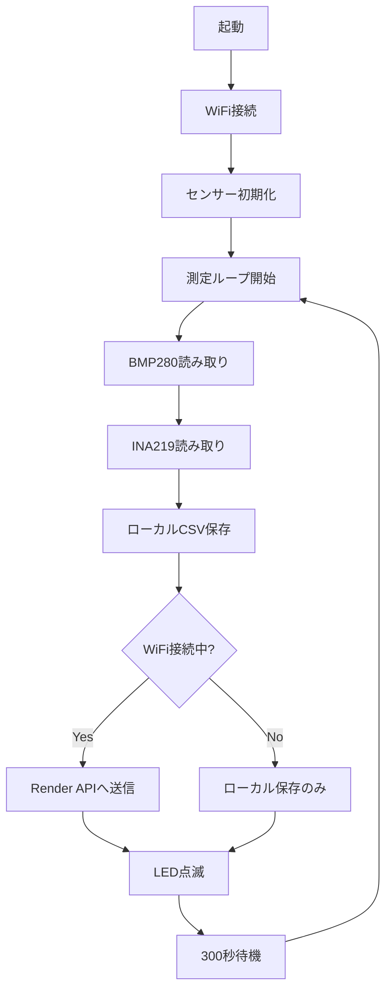

# ESP32 Sensor Logger with Render API Integration

ESP32ボードを使用してBMP280（温度・気圧・湿度）とINA219（電圧・電流・電力）のセンサーデータを取得し、Render PostgreSQLバックエンドに送信するシステムです。

## 📋 必要なハードウェア

- **ESP32開発ボード**
- **BMP280/BME280** 温度・気圧・湿度センサー（I2C接続）
- **INA219** 電流・電圧センサーモジュール（I2C接続）
- **ブレッドボード** と **ジャンパー線**

## 🔧 配線図

### I2Cバス共通接続
```
ESP32          BMP280/BME280       INA219
GPIO 22 (SCL) ─────┬────────────────┬────
GPIO 21 (SDA) ─────┼────────────────┼────
3.3V/5V       ─────┼────────────────┼──── (電源)
GND           ─────┴────────────────┴──── (グランド)
GPIO 2        ─── ステータスLED
```

### センサーI2Cアドレス
- **BMP280**: 0x76 or 0x77（デフォルト: 0x76）
- **INA219**: 0x40 ~ 0x45（デフォルト: 0x40）

## 📦 セットアップ手順

### 1. MicroPython のインストール

ESP32にMicroPythonファームウェアをインストール：

```bash
# ファームウェアダウンロード
# https://micropython.org/download/esp32/

# フラッシュ消去
esptool.py --port /dev/ttyUSB0 erase_flash

# MicroPython書き込み
esptool.py --chip esp32 --port /dev/ttyUSB0 write_flash -z 0x1000 esp32-*.bin
```

### 2. urequests ライブラリのインストール

HTTP通信に必要な`urequests`ライブラリをインストール：

```bash
# mpremoteを使用（推奨）
mpremote mip install urequests

# または、REPLから
import mip
mip.install("urequests")
```

### 3. WiFi設定

[passwords.py](passwords.py) ファイルを編集してWiFi設定を入力：

```python
# WiFi Settings
HOME_WIFI_SSID = 'YOUR_HOME_WIFI_SSID'  # ← 実際のSSIDに変更
HOME_WIFI_PASS = 'your_password'

LAB_WIFI_SSID = 'YOUR_LAB_WIFI_SSID'    # ← 実際のSSIDに変更
LAB_WIFI_PASS = 'your_lab_password'

# 使用するWiFi（'HOME' または 'LAB'）
WIFI_MODE = 'HOME'
```

### 4. ファイルのアップロード

ESP32にプロジェクトファイルをアップロード：

```bash
# mpremoteを使用
mpremote cp boot.py :boot.py
mpremote cp bmp280.py :bmp280.py
mpremote cp ina219.py :ina219.py
mpremote cp logging.py :logging.py
mpremote cp passwords.py :passwords.py

# または ampy を使用
ampy --port /dev/ttyUSB0 put boot.py
ampy --port /dev/ttyUSB0 put bmp280.py
ampy --port /dev/ttyUSB0 put ina219.py
ampy --port /dev/ttyUSB0 put logging.py
ampy --port /dev/ttyUSB0 put passwords.py
```

### 5. 動作確認

ESP32をリセットして起動ログを確認：

```bash
# シリアルモニターで接続
screen /dev/ttyUSB0 115200

# または mpremote
mpremote
```

## 🔄 動作フロー



## 📊 データ送信フォーマット

### Render API エンドポイント
```
POST https://m2r.onrender.com/api/measurements
```

### JSON ペイロード
```json
{
  "deviceId": "ESP32-001",
  "temperature": 25.3,
  "humidity": 60.5,
  "recordedAt": null,
  "payload": {
    "voltage_v": 4.98,
    "current_ma": 120.4,
    "power_mw": 600.5,
    "device_info": {
      "platform": "ESP32",
      "framework": "MicroPython"
    }
  }
}
```

## 💾 ローカルデータ保存

WiFi接続が失敗した場合でも、データはローカルCSVファイルに保存されます：

- **temp.csv**: 温度・気圧・湿度データ
- **elect.csv**: 電圧・電流・電力データ
- **debug.log**: デバッグログ

### CSVフォーマット

**temp.csv**:
```csv
timestamp_ms,temperature_c,pressure_pa,humidity_percent
12345678,25.3,101325,60.5
```

**elect.csv**:
```csv
timestamp_ms,voltage_v,current_ma,power_mw
12345678,4.98,120.4,600.5
```

## 🔍 ステータスLED

GPIO 2のLEDで動作状態を表示：

| パターン | 意味 |
|---------|------|
| 💡 点灯 | センサー読み取り中 |
| ⚡ 高速点滅（3回） | データ送信中 |
| ✅ ゆっくり点滅（2回） | 送信成功 |
| ⭕ 消灯 | 待機中 |

## 🐛 トラブルシューティング

### WiFi接続エラー

```
ERROR: WiFi connection timeout
```

**対処法**:
1. `passwords.py`のSSID/パスワードを確認
2. WiFiルーターの電波強度を確認
3. `WIFI_MODE`設定を確認（'HOME' or 'LAB'）

### センサー未検出

```
ERROR: No I2C devices found on the bus!
```

**対処法**:
1. 配線を確認（SCL=GPIO22, SDA=GPIO21）
2. センサーの電源供給を確認（3.3V or 5V）
3. プルアップ抵抗の確認（多くのモジュールは内蔵）
4. `i2c_scan.py`を実行してアドレス確認

### HTTP送信エラー

```
✗ API error: HTTP 500
```

**対処法**:
1. Render APIが起動しているか確認
2. `RENDER_API_URL`が正しいか確認
3. ネットワーク接続を確認
4. debug.logでエラー詳細を確認

### urequests未インストール

```
WARNING: urequests not available
```

**対処法**:
```bash
mpremote mip install urequests
```

## 📁 プロジェクト構成

```
esp32/
├── boot.py              # メインプログラム（WiFi + API送信）
├── passwords.py         # WiFi認証情報（要編集）
├── bmp280.py            # BMP280/BME280ドライバ
├── ina219.py            # INA219ドライバ
├── logging.py           # ロギングユーティリティ
├── temp.csv             # 温度データ（自動生成）
├── elect.csv            # 電力データ（自動生成）
├── debug.log            # デバッグログ（自動生成）
└── README.md            # このファイル
```

## ⚙️ 設定パラメータ

### boot.py 内の設定

```python
# API設定
RENDER_API_URL = "https://m2r.onrender.com/api/measurements"
DEVICE_ID = "ESP32-001"  # デバイスIDを変更可能

# 測定間隔（秒）
time.sleep(300)  # 5分間隔（変更可能）
```

### WiFi タイムアウト

```python
max_wait = 20  # WiFi接続タイムアウト（秒）
```

### HTTP リトライ設定

```python
max_retries = 3           # 最大リトライ回数
retry_delay = 2 * attempt # 指数バックオフ（2秒、4秒、6秒...）
```

## 📈 データ確認

### Renderダッシュボード

送信されたデータはWebダッシュボードで確認できます：

```
https://m2r-frontend.onrender.com
```

### PostgreSQL クエリ

```sql
-- 最新の測定データ
SELECT * FROM device_measurements
WHERE device_id = 'ESP32-001'
ORDER BY created_at DESC
LIMIT 10;
```

## 🔐 セキュリティ

- **WiFi認証情報**: `passwords.py`はGitで管理しない（.gitignore設定）
- **API認証**: 現在は未実装（必要に応じてトークン認証を追加）

## 📝 ライセンス

このプロジェクトはMITライセンスの下で公開されています。

## 🤝 サポート

問題が発生した場合：
1. `debug.log`を確認
2. シリアルモニターでリアルタイムログ��確認
3. センサーの配線を再確認
4. WiFi設定を確認

---

**作成者**: M2_R Project
**最終更新**: 2025-10-08
