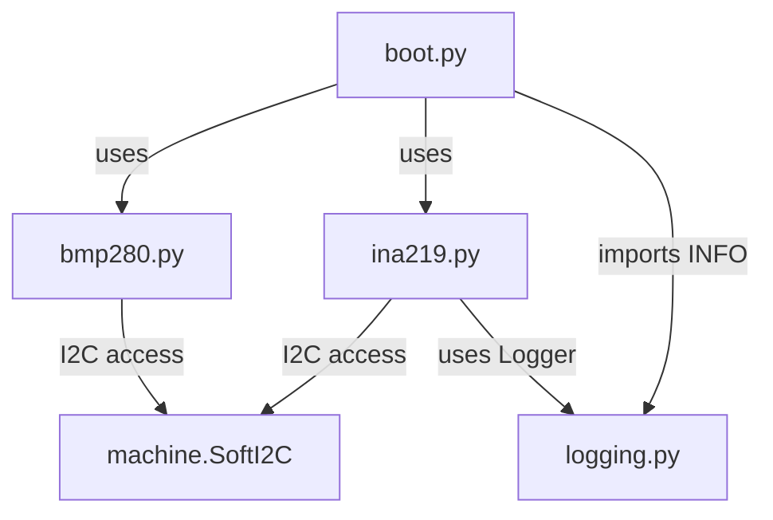

# ESP32 Data Logging Overview

## モジュールと役割
- `esp32/boot.py`: ESP32 起動時に実行されるメインスクリプト。I2C バスを初期化し、BME/BMP280 と INA219 の両センサーを共有バスでセットアップ。計測ループで 5 分ごとに温度と電力データを CSV に追記し、オンボード LED (`Pin(2)`) でステータスを表示。
- `esp32/bmp280.py`: Bosch BME280/BMP280 センサーの MicroPython ドライバ。キャリブレーション定数をロードし、`read()` 後に `temperature`/`pressure`/`humidity` プロパティで補正済み値を提供。
- `esp32/ina219.py`: INA219 電流/電圧センサーのドライバ。初期化時にシャント抵抗値を受け取り、`configure()` で測定レンジを設定。`voltage()`/`current()`/`power()` で瞬時値を返し、自動レンジ調整とオーバーフローハンドリングを実装。
- `esp32/logging.py`: MicroPython 向けの軽量ロガー。`INFO` などのレベル定義と `basicConfig()`/`getLogger()` を提供し、`ina219.py` から利用される。

## ファイル・関数・変数の接続
| 主要要素 | 役割 | 参照元/利用先 |
| --- | --- | --- |
| `SoftI2C(scl=Pin(22), sda=Pin(21))` | 温湿度・電力センサー共有の I2C バス | `boot.py` が生成し、`bmp280.BME280` と `INA219` に渡す |
| `bmp_sensor = bmp280.BME280(i2c)` | BME/BMP280 ドライバのインスタンス | 温度取得 (`bmp_sensor.read()`, `bmp_sensor.temperature`) |
| `ina = INA219(SHUNT_OHMS, i2c, log_level=INFO)` | INA219 ドライバ初期化 | `ina.configure()` で測定条件を設定し、電力取得で使用 |
| `temp_f = "temp.csv"` | 温度ログファイル | `boot.py` の `with open(temp_f, "a")` で追記 |
| `elect_f = "elect.csv"` | 電力ログファイル | `boot.py` の `with open(elect_f, "a")` で追記 |
| `blue = Pin(2, Pin.OUT)` | ステータス LED (D2) | 計測前後で 0/1 切替え |
| `BME280.read(force=True, ...)` | センサー設定を I2C へ書き込み、最新値を取得 | `boot.py` の計測ループから呼び出し |
| `INA219.voltage()/current()/power()` | バス電圧[V]・電流[mA]・電力[mW] を返す | 電力 CSV 出力ラインの生成 |
| `logging.basicConfig(level)` | INA219 内部ログ設定 | `INA219.__init__` から呼び出し、ロギングレベルを `INFO` に設定 |

## 依存関係 (Mermaid)


## 動作フロー (Mermaid)
```mermaid
flowchart TD
    boot[起動時: boot.py] --> init_i2c[I2C/センサー初期化]
    init_i2c --> led_off[LED を LOW にして計測開始]
    led_off --> read_temp[BME280: read() 実行]
    read_temp --> log_temp[温度を temp.csv に追記]
    log_temp --> read_power[INA219 で電圧/電流/電力取得]
    read_power --> log_power[値を elect.csv に追記]
    log_power --> led_on[LED を HIGH にしてアイドル表示]
    led_on --> sleep[300 秒スリープ]
    sleep --> led_off
    read_temp -->|例外| temp_error[例外を print]
    temp_error --> read_power
```

## 補足メモ
- `bmp280.BME280` は初期化時にセンサーのキャリブレーションデータを読み込み、`read()` 呼び出しでオーバーサンプリング設定を強制 (`MODE_FORCED`)。演算結果は `temperature` 等のプロパティで算出され、CSV には摂氏が書き込まれる。
- `INA219` は `configure()` によりゲイン/ADC 分解能を決定し、`_handle_current_overflow()` で測定値のオーバーフロー検出とゲイン自動調整を行う。`voltage()` はボルト単位、`current()` はミリアンペア、`power()` はミリワットを返す。
- ファイル出力は追記モードのため、電源再投入後も値が累積される。CSV 管理や転送は別途実装が必要。
- LED (GPIO2) の点灯でループ完了を示し、5 分周期 (`time.sleep(300)`) で連続計測する。
